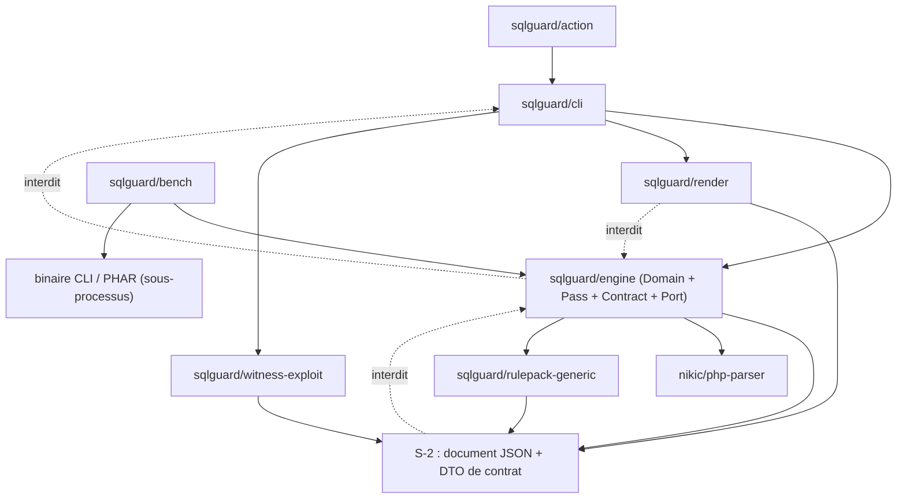
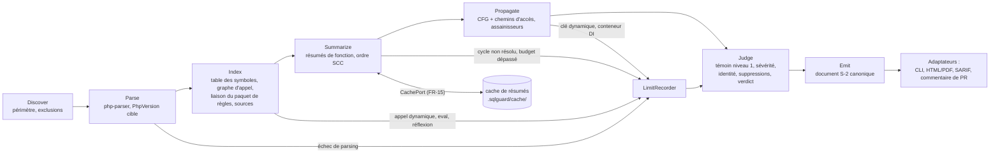
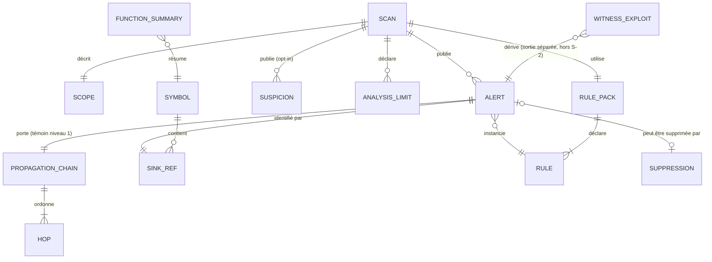

# Architecture Spine — sqlguard

## Design Paradigm

**Pipes-and-filters à l'intérieur d'une frontière hexagonale.**

- *Pipes-and-filters* : l'analyse est une chaîne ordonnée et fermée de passes sans état partagé mutable, chacune consommant l'artefact de la précédente. Aucune passe ne saute une passe ; aucune passe n'écrit dans l'artefact d'une passe amont.
- *Hexagonal* : le moteur est le cœur ; il ne connaît que des **ports** (système de fichiers, cache, VCS). CLI, action GitHub, rapport, SARIF et harnais sont des **adaptateurs**. FR-18 exige que le moteur soit consommable sans CLI : la direction de dépendance (AD-2) est donc une règle, pas une préférence.

| Couche | Paquet Composer | Namespace / répertoire |
|---|---|---|
| Cœur — domaine (entités, verdict, identité) | `sqlguard/engine` | `SqlGuard\Engine\Domain\` — `packages/engine/src/Domain/` |
| Cœur — chaîne de passes | `sqlguard/engine` | `SqlGuard\Engine\Pass\` — `packages/engine/src/Pass/` |
| Cœur — contrat de sortie S-2 | `sqlguard/engine` | `SqlGuard\Engine\Contract\` — `packages/engine/src/Contract/` |
| Cœur — ports (interfaces) | `sqlguard/engine` | `SqlGuard\Engine\Port\` — `packages/engine/src/Port/` |
| Adaptateurs infra (fichiers, cache, git) | `sqlguard/engine` | `SqlGuard\Engine\Infra\` — `packages/engine/src/Infra/` |
| Paquet de règles générique | `sqlguard/rulepack-generic` | `SqlGuard\RulePack\Generic\` — `packages/rulepack-generic/` |
| Adaptateur CLI | `sqlguard/cli` | `SqlGuard\Cli\` — `packages/cli/` |
| Adaptateurs de rendu (HTML/PDF, SARIF, commentaire de PR) | `sqlguard/render` | `SqlGuard\Render\` — `packages/render/` |
| Adaptateur action GitHub | `sqlguard/action` | `packages/action/` (wrapper du binaire CLI) |
| Témoin exploitable (niveau 2) | `sqlguard/witness-exploit` | `SqlGuard\WitnessExploit\` — `packages/witness-exploit/` |
| Harnais de mesure et corpus | `sqlguard/bench` (dev) | `SqlGuard\Bench\` — `packages/bench/`, `corpus/` |

## Invariants & Rules

Direction de dépendance autorisée — **toute flèche absente est interdite** :



### AD-1 — Runtime de l'outil ≥ PHP 8.2 ; cible analysée PHP 5.6 → 8.5

- **Binds:** all — lève l'arbitrage laissé ouvert par PRD §17 et par les « exigences additionnelles provisoires » de epics.md
- **Prevents:** livrer un outil de sécurité sur un runtime en fin de vie (7.4, 8.0, 8.1 sont EOL), ou restreindre l'analyse au PHP moderne et rater le marché legacy — les deux versions sont ici distinctes et nommées séparément.
- **Rule:** `composer.json` de chaque paquet déclare `"php": ">=8.2"`. Matrice CI : 8.2, 8.3, 8.4, 8.5 ; aucune tolérance 8.1/7.4 pour exécuter `sqlguard`. La **cible d'analyse** est PHP 5.6 à 8.5, obtenue via `PhpParser\PhpVersion` (php-parser v5 parse la syntaxe ancienne depuis un runtime moderne) ; la version cible est un paramètre du périmètre d'analyse (`scope.php_target`), par défaut la plus permissive. Aucun code du moteur ne suppose que la version du runtime égale la version cible.

### AD-2 — Le moteur ne dépend d'aucun adaptateur [ADOPTED — PRD §14 S-4, FR-18]

- **Binds:** FR-18, E3, E4, SM-8
- **Prevents:** la logique d'analyse dupliquée entre CLI et action GitHub, et l'impossibilité d'un second consommateur sans fork.
- **Rule:** `sqlguard/engine` ne requiert que `nikic/php-parser` et `sqlguard/rulepack-generic`. Toute mention de `SqlGuard\Cli`, `SqlGuard\Render`, `SqlGuard\WitnessExploit`, `Symfony\Component\Console` ou d'un accès à `STDOUT`/`STDERR` dans `packages/engine/` fait échouer la CI (test d'architecture automatisé sur le graphe de dépendances, exécuté à chaque commit). Le graphe ci-dessus est la référence normative.

### AD-3 — Chaîne de passes fermée et ordonnée

- **Binds:** FR-1 à FR-7, FR-15, NFR-1, NFR-6, NFR-7
- **Prevents:** deux builders insérant la même responsabilité à deux étages (ex. reconnaissance d'assainisseur à la fois en propagation et en verdict), ce qui rendrait le rappel non reproductible.
- **Rule:** l'ordre est `Discover → Parse → Index → Summarize → Propagate → Judge → Emit`, déclaré une seule fois dans `SqlGuard\Engine\Pass\PassChain`. Une passe reçoit un artefact immuable et retourne un nouvel artefact ; elle n'a pas de référence vers la passe suivante. Ajouter une passe exige de modifier `PassChain` et d'incrémenter `ENGINE_SCHEMA_VERSION` (AD-7). Répartition des responsabilités, exclusive : sources → `Index` ; propagation → `Propagate` ; assainisseurs → `Propagate` (rupture d'arête, jamais filtrage a posteriori) ; sévérité, témoin, suppressions, verdict → `Judge` ; sérialisation → `Emit`.



### AD-4 — Représentation du flux intra-procédural : CFG de blocs de base + état par chemin d'accès

- **Binds:** FR-2, FR-4, prérequis des stories 3.2 et 3.3
- **Prevents:** un builder modélisant l'état par nom de variable et un autre par expression, produisant des verdicts opposés sur `$a['k']` et sur la réaffectation par valeur sûre.
- **Rule:** par symbole analysé, un **CFG de blocs de base** est construit sur l'AST de php-parser (`SqlGuard\Engine\Domain\Flow\ControlFlowGraph`), avec jointure aux confluences par **union** des états. L'état est une application *chemin d'accès → treillis de marque*. Un chemin d'accès est `variable[.prop|[cléLittérale]]*`, **profondeur maximale 2** ; au-delà, ou sur clé non littérale, le conteneur entier devient une cellule agrégée et l'imprécision est consignée dans les limites d'analyse (AD-15). Treillis : `Clean < Sanitized(context) < Tainted(sourceRef)`, `Unknown` traité comme `Clean` pour l'émission d'alerte (NFR-3 : pas d'alerte sans témoin complet) et consigné en `suspicion`. La réaffectation écrase le chemin d'accès ; elle ne fusionne pas. Aucune analyse sensible au chemin d'exécution en V1 (voir Deferred).

### AD-5 — Identité d'un point de sink indépendante de la ligne

- **Binds:** FR-3, FR-17, NFR-1, prérequis de la story 3.2
- **Prevents:** rattacher un sink à une position intermédiaire arbitraire, et faire dépendre l'identité d'alerte d'un numéro de ligne.
- **Rule:** `SinkRef = {rule_id, symbol_fqn, sink_kind, ordinal}` où `symbol_fqn` est le nom pleinement qualifié du symbole englobant (`\Ns\Cls::method`, `\Ns\fn`, ou `<file:relative/path.php>` pour le code de premier niveau), `sink_kind ∈ {pdo.query, pdo.exec, pdo.prepare_dynamic, pdo.statement_execute}`, et `ordinal` est l'index 0-based du n-ième sink **du même kind** rencontré dans ce symbole en parcours préfixe déterministe de l'AST. Un `PDOStatement` issu d'un `prepare` dynamique est rattaché au `SinkRef` de la position d'exécution SQL. Les positions `fichier:ligne:colonne` sont des données d'affichage portées à côté du `SinkRef`, jamais son identité.

### AD-6 — Résumés interprocéduraux : contenu fixé, ordre SCC en fixpoint borné

- **Binds:** FR-2, FR-15, NFR-6, prérequis de la story 3.4
- **Prevents:** deux stratégies concurrentes (inlining à la demande vs résumés) donnant des profondeurs d'appel et des temps incomparables, et une non-terminaison sur récursion mutuelle.
- **Rule:** un `FunctionSummary` retient exactement : `symbol_fqn` ; pour chaque paramètre (par index et par nom) `reaches_return: bool`, `reaches_sink: SinkRef[]`, `sanitized_by: sanitizerId[]`, `hop_template[]` (squelette de sauts pour reconstituer la chaîne chez l'appelant) ; `returns_tainted_unconditionally: bool` ; `side_taints` (écritures de propriétés d'objet et de statiques) ; `unresolved: reasonCode[]`. Le graphe d'appel est condensé en composantes fortement connexes (Tarjan) et analysé en **ordre topologique inverse** ; à l'intérieur d'une SCC, fixpoint ascendant sur le treillis d'AD-4, **maximum 8 itérations**, puis widening vers `unresolved` et une entrée de limites. Profondeur d'appel garantie ≥ 5 sauts. Un appel non résolu (appel dynamique, conteneur DI, symbole hors périmètre) ne produit jamais d'alerte : il produit une entrée de limites, et au plus une `suspicion`.

### AD-7 — Format de persistance du cache de résumés, et sa clé

- **Binds:** FR-15, NFR-1, NFR-9, prérequis de la story 3.10
- **Prevents:** un cache indexé par une base de données ou par chemin absolu, un cache partagé entre versions, et le résultat partiel silencieux.
- **Rule:** un fichier JSON par fichier source analysé, adressé par contenu, sous `<racine analysée>/.sqlguard/cache/<cache_key>/<sha256(octets du fichier)>.json`. Aucune base, aucun index global, aucun démon (NFR-9). `cache_key = sha256(ENGINE_SCHEMA_VERSION | tool_version_major_minor | rule_pack_id | rule_pack_version | php_target)`. Un fichier de cache contient `{"cache_key", "source_sha256", "summaries": FunctionSummary[]}` — la même sérialisation que le DTO en mémoire, sans champ dérivé. Toute entrée illisible, de `cache_key` inconnu ou de `source_sha256` non concordant est **ignorée** et déclenche l'analyse complète du fichier ; jamais un résultat partiel. Un scan servi par le cache doit produire un document S-2 identique après normalisation (AD-13) à un scan complet du même commit : test de non-régression en CI. Le cache n'est écrit que par `SqlGuard\Engine\Infra\FileSummaryCache` derrière `CachePort` ; aucun adaptateur n'y écrit.

### AD-8 — Manifeste de règles unique, clé de jointure de tout le système

- **Binds:** FR-16, FR-11, FR-13, FR-17, E5 / story 5.2, documentation-plan.md
- **Prevents:** trois vocabulaires de règles divergents (moteur, corpus annoté, pages de documentation), et une sévérité recalculée différemment par un adaptateur.
- **Rule:** `rules/manifest.json` est la seule source de vérité : par règle, `{id, title, severity ∈ {high,medium,low}, sink_kinds[], doc_slug, introduced_in, default_enabled}`. `id` respecte `sqlguard.<famille>.<slug>` en `[a-z0-9._-]`. Lisent ce manifeste, et lui seul : le chargement des paquets de règles, le tableau `rules[]` SARIF, la génération des pages Starlight, les annotations du corpus, la validation des suppressions. **La sévérité est une donnée du manifeste** ; aucun adaptateur ni renderer ne la calcule ni ne la remappe. Une règle nouvelle arrive `default_enabled: false` ; son activation par défaut exige un changement de version du paquet de règles, jamais un correctif.

### AD-9 — Hash structurel d'identité d'alerte

- **Binds:** FR-17, NFR-1, PRD §14, prérequis de la story 4.5
- **Prevents:** un identifiant instable au reformatage ou au déplacement de lignes, qui invaliderait silencieusement les suppressions des utilisateurs — et deux recettes de hash divergentes entre builders.
- **Rule:** `alert.id = "SG1-" . substr(bin2hex(sha256(payload)), 0, 16)` où `payload` est la concaténation, par `"\u{1F}"`, **exactement de ces sept champs dans cet ordre** :
  1. `rule_id` (AD-8)
  2. `rule_pack_id`
  3. version **majeure** du paquet de règles (jamais mineure ni correctif)
  4. chemin du fichier du sink, forme canonique d'AD-25
  5. `SinkRef.symbol_fqn` (AD-5)
  6. `SinkRef.sink_kind`
  7. `SinkRef.ordinal` en décimal
  N'entrent **pas** dans le payload : numéro de ligne, colonne, extrait de code, blanc, commentaire, noms de variables locales, longueur de la chaîne de propagation, positions intermédiaires, version de l'outil. Conséquences testables : un fichier reformaté conserve l'identifiant ; une version mineure de l'outil conserve l'identifiant ; renommer le symbole englobant ou déplacer le sink dans un autre symbole le change (c'est un défaut différent).

### AD-10 — Un seul calculateur d'identité, une seule instance productrice d'`Alert`

- **Binds:** FR-17, FR-10, FR-11, NFR-1
- **Prevents:** *trou fermé* — CLI et générateur de rapport recalculant chacun le hash (deux implémentations, deux dérives) ; deux propriétaires de l'entité `Alert`.
- **Rule:** `SqlGuard\Engine\Domain\Identity\StructuralHasher` est la seule implémentation d'AD-9 dans le dépôt ; un test de CI échoue si `sha256`, `hash(` ou `md5` apparaît ailleurs que dans ce fichier et dans le cache d'AD-7. `Alert` et `Suspicion` sont construites **uniquement** par la passe `Judge`, sont `final` et immuables, sans setter. Les adaptateurs consomment le document S-2 (AD-12) ; ils ne peuvent ni instancier, ni muter, ni recréer une alerte, ni réordonner ses sauts.

### AD-11 — Schéma de champs S-2 et politique de versionnage

- **Binds:** FR-8, FR-10, FR-11, FR-12, FR-13, NFR-1, PRD §14 S-2, prérequis des stories 3.7 et 4.1
- **Prevents:** chaque adaptateur inventant sa propre forme de sortie, et un ajout de champ traité comme rupture (ou l'inverse).
- **Rule:** document racine, champs obligatoires et types fixés :

```text
{ "schema_version": "MAJEURE.MINEURE",     // version de S-2, indépendante de tool_version
  "tool_version":   "x.y.z",
  "rule_pack":      { "id": string, "version": "x.y.z" },
  "php_target":     string,                 // version cible d'analyse (AD-1)
  "commit":         string(40)|null,
  "status":         "complete"|"incomplete",
  "witness_level":  1,                      // littéral 1 ; aucune autre valeur n'est valide (AD-17)
  "scope":          { "root": ".", "files_included": int, "files_excluded": int,
                      "php_lines": int, "included_globs": string[], "excluded_globs": string[] },
  "alerts":         Alert[],
  "suspicions":     Suspicion[],            // [] si le canal est désactivé (défaut)
  "analysis_limits": Limit[],
  "suppressions":   { "count": int, "entries": Suppression[] },
  "uncovered_sinks": { "mysqli": int, "wpdb": int, "tracking_issue": string } }

Alert = { "id": "SG1-<16 hex>", "rule_id": string, "severity": "high"|"medium"|"low",
          "sink": { "ref": { "symbol_fqn": string, "sink_kind": string, "ordinal": int },
                    "file": string, "line": int, "col": int },
          "chain": Hop[],                    // longueur ≥ 1, dernier élément = le sink
          "suppressed": bool, "suppression_reason": string|null, "doc_url": string }
Hop   = { "kind": "source"|"assign"|"concat"|"interp"|"array_write"|"array_read"|"arg"|"return"|"sink",
          "file": string, "line": int, "col": int, "symbol_fqn": string, "snippet": string(<=200) }
Suspicion = { "rule_id": string, "reason_code": string, "file": string, "line": int, "symbol_fqn": string }
Limit = { "reason_code": "dynamic_call"|"eval"|"reflection"|"computed_include"|"di_container"|
                         "parse_error"|"time_budget"|"memory_budget"|"recursion_widened"|"dynamic_key",
          "file": string|null, "line": int|null, "detail": string }
Suppression = { "alert_id": string, "file": string, "line": int, "reason": string }
```

Versionnage : ajout de champ optionnel = `schema_version` mineure ; retrait, renommage ou changement de sémantique = majeure. Aucun champ additionnel non déclaré n'est émis (`additionalProperties: false` dans le JSON Schema publié sous `contracts/s2/<majeure>.schema.json`, validé en CI). Rendre une règle plus sensible est une rupture (PRD §14) : elle sort en majeure d'outil ou derrière un opt-in.

### AD-12 — S-2 est l'unique amont de tous les rendus ; seul le moteur lit le code analysé

- **Binds:** FR-8, FR-9, FR-10, FR-11, prérequis de la story 4.3
- **Prevents:** *trou fermé* — le générateur de rapport rouvrant les fichiers sources pour ses extraits pendant que la CLI utilise `snippet`, produisant deux vérités sur le même code ; et un champ de rapport sans propriétaire.
- **Rule:** rapport autoportant HTML/PDF, sortie SARIF 2.1.0, commentaire de PR et sortie humaine CLI sont des **fonctions pures du document S-2**. Aucun paquet hors `sqlguard/engine` n'ouvre un fichier du dépôt analysé : le seul extrait de code disponible est `Hop.snippet`. Tout champ nécessaire à un rendu et absent de S-2 doit être ajouté à S-2 (AD-11) ; il ne peut pas être obtenu latéralement. Le PDF est dérivé du HTML, jamais rendu depuis S-2 par un second chemin.

### AD-13 — Règle de normalisation avant comparaison byte à byte

- **Binds:** NFR-1, FR-5, FR-13, FR-15, prérequis de la story 3.7
- **Prevents:** un test de déterminisme qui échoue sur un ordre de tableau, un horodatage ou un chemin absolu — et donc des tests désactivés.
- **Rule:** l'émission S-2 est déjà normalisée à la source, pas post-traitée. (a) Clés d'objet émises dans l'ordre déclaré par le schéma. (b) `alerts` triées par `(sink.file, sink.ref.symbol_fqn, sink.ref.sink_kind, sink.ref.ordinal, rule_id, id)` ; `suspicions` et `analysis_limits` par `(file, line, reason_code)` ; `chain` en ordre de flux, jamais retriée. (c) Aucun horodatage, aucune durée, aucun chemin absolu, aucun nom de machine, aucun PID, aucun flottant dans S-2 ; les temps par phase et la file d'analyse de `--verbose` (NFR-7) sortent sur **stderr** et ne sont pas dans le document. (d) Encodage : UTF-8, sauts de ligne `LF`, JSON avec `JSON_UNESCAPED_SLASHES|JSON_UNESCAPED_UNICODE`, indentation 2 espaces, saut de ligne final unique. (e) Périmètre parcouru en ordre lexicographique d'octets ; aucune concurrence non ordonnée n'est autorisée à influencer l'ordre de sortie.

### AD-14 — Verdict, seuil, baseline et filtre de diff : un seul propriétaire

- **Binds:** FR-12, FR-9, FR-17, NFR-6, prérequis de la story 4.2
- **Prevents:** *trou fermé* — la CLI et l'action GitHub implémentant chacune « alertes introduites par le diff » et « baseline », de sorte que la même PR passe en local et échoue en CI.
- **Rule:** `SqlGuard\Engine\Domain\Policy\VerdictCalculator` est la seule à calculer un verdict. Entrées : document S-2, seuil, fichier de baseline, ensemble d'identifiants d'alerte du diff. Sortie : `Verdict = {code ∈ {Ok=0, AlertsAboveThreshold=1, Incomplete=2}, counts_by_severity, introduced_ids[], baselined_ids[]}`. Précédence, non négociable : `status: "incomplete"` ⇒ code 2, toujours, même en présence d'alertes de gravité haute — une analyse incomplète n'est jamais interprétable comme « code sûr ». Les `suspicions` n'entrent jamais dans un verdict. La baseline et le filtre de diff s'apparient sur `alert.id` (AD-9), jamais sur `fichier:ligne`. Les adaptateurs se contentent de retourner `Verdict.code` comme code de sortie ; l'action GitHub ne sort **jamais** en échec sur `Incomplete` (FR-9) : elle publie un commentaire d'exécution partielle et rend 0.

### AD-15 — Registre unique des limites d'analyse, en ajout seul

- **Binds:** FR-2, NFR-6, NFR-7, FR-10, prérequis de la story 3.6
- **Prevents:** *trou fermé* — deux passes (Parse et Propagate) écrivant chacune sa liste de limites, dont une seule est rendue ⇒ alerte silencieuse.
- **Rule:** une instance unique de `LimitRecorder` circule dans le contexte du pipeline, en **ajout seul** ; aucune passe ne lit ni ne filtre les limites d'une autre, seul `Judge` les consomme. Toute construction non suivie utilise un `reason_code` de l'énumération fermée d'AD-11 ; ajouter un code exige un changement de `schema_version` mineur. Invariant vérifié en CI : toute décision de ne pas suivre une construction produit exactement une entrée de limites ; aucune n'est convertie en alerte.

### AD-16 — Suppressions résolues dans le moteur, jamais effacées

- **Binds:** FR-17, FR-10, prérequis de la story 4.5
- **Prevents:** un adaptateur filtrant les alertes supprimées avant rendu, ce qui rend la suppression invisible — un mensonge d'audit.
- **Rule:** annotation en ligne `@sqlguard-ignore <ALERT_ID> <motif>` dans un commentaire portant sur la ligne du sink ou la ligne précédente. Motif vide ou identifiant inconnu ⇒ suppression **refusée** et alerte comptée. `Judge` marque `suppressed: true` et remplit `suppression_reason` : l'alerte **reste dans `alerts[]`** et est répétée dans `suppressions.entries`. Aucun renderer ne supprime une alerte du document ; le rapport autoportant affiche le nombre et le détail.

### AD-17 — Témoin exploitable cloisonné hors du contrat S-2

- **Binds:** FR-6, PRD §11.1, prérequis de la story 3.8
- **Prevents:** une charge armée fuitant dans un artefact de CI par un champ générique ou un rendu opportuniste.
- **Rule:** S-2 n'a **aucun** champ capable de porter un témoin de niveau 2 (`witness_level` est le littéral `1`) : la fuite est impossible par construction, pas par discipline. Le niveau 2 est produit par `sqlguard/witness-exploit`, qui consomme S-2 et écrit un fichier distinct avec en-tête d'avertissement, ajouté au `.gitignore` du dépôt analysé s'il n'y figure pas. Double opt-in obligatoire : drapeau `--witness=exploitable` **et** confirmation dans la configuration locale ; l'un sans l'autre échoue. Le paquet ne connaît ni le rapport, ni SARIF, ni le commentaire de PR. L'action GitHub échoue au démarrage si la configuration demande `exploitable`. `sqlguard/witness-exploit` n'exécute jamais rien et n'ouvre aucune connexion de base.

### AD-18 — Aucune exécution du code analysé, aucun port réseau dans le moteur [ADOPTED — NFR-4, NFR-5]

- **Binds:** NFR-4, NFR-5, all
- **Prevents:** une stratégie de résolution reposant sur `include` de la cible, l'instanciation d'un conteneur DI du dépôt analysé, ou une récupération de règles en ligne pendant un scan.
- **Rule:** interdits dans tous les paquets d'analyse : `eval`, `assert` sur chaîne, `create_function`, `include*`, `require*`, `exec`/`shell_exec`/`system`/`proc_open`/`passthru`/`popen`, `unserialize` sur données de la cible, autoload ou instanciation d'un symbole du code analysé. Contrôle CI par liste de fonctions interdites (règle PHPStan dédiée) sur `packages/engine`, `packages/rulepack-*`, `packages/render`, `packages/witness-exploit`. Aucun port réseau n'est déclaré dans `SqlGuard\Engine\Port` : le seul composant autorisé à émettre du trafic est `sqlguard/action`, et seulement **après** la fin de l'analyse, pour publier son commentaire. Test d'intégration : scan en environnement isolé du réseau, résultat identique ; scan d'un fichier à effet de bord observable, aucun effet observé.

### AD-19 — Surface `@api` énumérée et fermée

- **Binds:** FR-18, PRD §14 S-4, prérequis de la story 3.9
- **Prevents:** *trou fermé* — le consommateur aval s'accrochant à une classe interne, et l'action GitHub court-circuitant la CLI pour appeler le pipeline.
- **Rule:** exactement ces éléments portent `@api` ; tout le reste est `@internal` et modifiable en version mineure :

| Élément `@api` | Rôle |
|---|---|
| `SqlGuard\Engine\Analysis` (final) | point d'entrée unique : `analyze(AnalysisRequest): AnalysisResult` |
| `SqlGuard\Engine\AnalysisRequest` (final, immuable) | périmètre, globs d'exclusion, `php_target`, paquet de règles, options de canal |
| `SqlGuard\Engine\AnalysisResult` (final, immuable) | `alerts()`, `suspicions()`, `analysisLimits()`, `scope()`, `status()`, `toS2Array()` |
| `SqlGuard\Engine\Domain\Alert`, `Suspicion`, `PropagationChain`, `Hop`, `SinkRef`, `AnalysisLimit`, `Severity` | entités de résultat, en lecture seule |
| `SqlGuard\Engine\Domain\Policy\VerdictCalculator`, `Verdict` | verdict (AD-14) |
| `SqlGuard\Engine\Contract\S2Document`, `S2Writer` | contrat de sortie machine (AD-11) |
| `SqlGuard\Engine\RulePack\RulePack`, `RulePackDefinition`, `SourceDefinition`, `SinkDefinition`, `SanitizerDefinition` | définition d'un paquet de règles (FR-16) |
| `SqlGuard\Engine\Port\FileSystemPort`, `CachePort`, `VcsPort` | ports substituables |

Un test de CI compare la liste des symboles `@api` à ce tableau et échoue en cas d'écart. `Analysis` est le seul point d'entrée : ni la CLI, ni l'action, ni les harnais n'instancient une passe.

### AD-20 — Format de sérialisation du corpus annoté, ancré et non positionnel

- **Binds:** FR-13, NFR-2, NFR-8, prérequis de la story 2.2
- **Prevents:** *trou fermé* — le corpus (E2, écrit avant le moteur) annotant par numéro de ligne et par vocabulaire propre, incomparable au résultat du moteur (E3) ; et l'annotation devenue fausse au premier reformatage.
- **Rule:** un cas = un répertoire `corpus/<version>/cases/<case_id>/` contenant les fichiers PHP du cas et un `expect.json` unique :

```text
{ "case_id": "kebab-case-stable",
  "corpus_version": "x.y.z",
  "php_target": "5.6"|"7.4"|"8.2"|…,
  "verdict": "positive"|"negative",
  "provenance": { "origin": string, "license": string },
  "expected": [ { "rule_id": string,                      // AD-8
                  "source_anchor": string,                // ancre commentaire
                  "sink_anchor": string,
                  "sink_kind": string,                    // AD-5
                  "min_hops": int } ],
  "notes": string }
```

L'ancrage est un commentaire dans le code du cas : `/* sqlguard:anchor <nom> */` sur la ligne visée — **jamais** un numéro de ligne. `verdict: "negative"` impose `expected: []` et attend zéro alerte. Le corpus est gelé : toute modification exige une nouvelle `corpus_version` et une entrée de journal ; ajouter un cas pour faire passer une mesure est interdit par la règle écrite du corpus.

### AD-21 — Appariement du harnais qualité : sur l'identité, pas sur l'intérieur de la chaîne

- **Binds:** FR-13, NFR-2, prérequis de la story 2.3
- **Prevents:** *trou fermé* — un harnais comparant les chaînes saut par saut, qui compte un faux positif à chaque amélioration légitime du moteur, rendant NFR-2 impilotable.
- **Rule:** une alerte est appariée à une entrée `expected` si et seulement si `rule_id` concorde, la position du sink résout la même ancre `sink_anchor`, `sink_kind` concorde, et la chaîne contient un saut résolvant `source_anchor`. `count(chain) ≥ min_hops` est vérifié ; l'ordre et le contenu exact des sauts intermédiaires ne le sont pas. Rappel = appariées / `expected` total. FP/10 kLOC = alertes non appariées ÷ (kLOC × 10) ; les `suspicions` ne sont comptées ni comme alerte ni comme faux positif. Résultats écrits dans un fichier versionné portant `corpus_version`, `tool_version`, `rule_pack.version` et la version exacte de chaque outil comparé. Les seuils de NFR-2 (rappel ≥ 85 %, ≤ 3 FP/10 kLOC) ne sont pas ajustables par le harnais.

### AD-22 — Points d'entrée des bancs, nommés et distincts

- **Binds:** FR-14, FR-13, NFR-8, NFR-10, prérequis de la story 2.1
- **Prevents:** un banc de performance mesurant une API interne pendant que les utilisateurs subissent le coût d'amorçage de la CLI ; et un banc de qualité dépendant du texte lisible.
- **Rule:** deux cibles, deux frontières, aucune autre. `make bench-perf` → `packages/bench/bin/perf` lance le **binaire livré** (`vendor/bin/sqlguard` ou le PHAR) en **sous-processus** avec `--format=json`, et relève temps mural, pic de mémoire (RSS du processus), fichiers analysés et nombre de limites — c'est le chemin réellement livré. `make bench-quality` → `packages/bench/bin/quality` appelle `SqlGuard\Engine\Analysis` **en bibliothèque** (AD-19) et lit `toS2Array()`. Aucun banc ne parse la sortie humaine, aucun banc n'appelle une passe. Les résultats sont écrits dans `bench/results/<date>-<tool_version>.json` versionnés ; les budgets `PB-n` sont rédigés après publication et citent la valeur mesurée dont ils dérivent.

### AD-23 — Paquets de règles : format déclaratif, versionnés indépendamment

- **Binds:** FR-16, FR-1, FR-4, PRD §14, §15
- **Prevents:** des règles codées en dur dans le moteur, et une version de paquet de règles absente des sorties (donc une mesure non reproductible).
- **Rule:** un paquet de règles est du **JSON déclaratif** (`rulepack.json` : `id`, `version` SemVer, `sources[]`, `sinks[]`, `sanitizers[]`, `rules[]` référençant AD-8), chargé par `RulePackLoader` ; il ne contient aucun PHP exécutable. Le paquet `generic` est actif par défaut, les paquets d'écosystème sont opt-in. `rule_pack.id`/`version` figurent dans toute sortie (AD-11) et dans la clé de cache (AD-7). La configuration utilisateur peut **ajouter** sources et assainisseurs ; elle ne peut ni retirer un sink, ni abaisser une sévérité. Toute mesure publiée est faite en configuration par défaut.

### AD-24 — Aucun état hors du dépôt analysé ; ni service, ni base, ni démon [ADOPTED — PRD §11.3, NFR-9]

- **Binds:** NFR-9, FR-15, all
- **Prevents:** un cache en base SQLite ou en répertoire utilisateur global, qui rendrait deux machines non comparables et ferait entrer une dépendance de service.
- **Rule:** le seul état écrit est sous `<racine analysée>/.sqlguard/` (cache d'AD-7, baseline, sortie de niveau 2). Aucun accès à `$HOME`, aucun répertoire de cache système, aucun processus résident, aucun moteur de base de données. `composer require --dev` puis une commande suffit ; test d'installation en conteneur vierge en CI.

### AD-25 — Forme canonique des positions

- **Binds:** NFR-1, FR-9, FR-10, FR-17, AD-9
- **Prevents:** *trou fermé* — le hash d'identité calculé sur un chemin absolu chez un builder et relatif chez l'autre ⇒ suppressions rompues entre machines ; permaliens de PR faux.
- **Rule:** un chemin dans toute sortie et dans tout hash est **relatif à la racine du scan**, séparateur `/`, sans `./` initial, sans résolution de lien symbolique, en NFC. Les lignes et colonnes sont **1-based**. Les permaliens de l'action GitHub sont construits par l'adaptateur à partir de `commit` + chemin canonique + ligne ; ils ne sont jamais persistés dans S-2.

### AD-26 — Distribution : paquet Composer `--dev` et PHAR, dépendances de production minimales

- **Binds:** NFR-9, PRD §17, E4
- **Prevents:** un conflit de résolution Composer chez l'utilisateur, et un PHAR non reproductible.
- **Rule:** dépendances de production : `sqlguard/engine` → `nikic/php-parser` uniquement ; `sqlguard/cli` → `symfony/console` uniquement ; aucun framework complet, aucun parser SQL en V1. La PHAR est construite avec versions épinglées et construction reproductible et vérifiable. Linux et macOS testés en CI ; Windows au mieux, non testé en V1.

**Paires divergentes examinées et fermées** (deux unités conformes à toutes les AD précédentes qui construisaient pourtant de façon incompatible) :

| Paire hypothétique | Divergence | Fermée par |
|---|---|---|
| Générateur de rapport HTML vs sortie CLI JSON | chacun recalculait l'identifiant d'alerte, l'un incluant la ligne | AD-9 + AD-10 |
| Corpus annoté (E2) vs moteur (E3) | annotation par ligne et vocabulaire de règles local, incomparable | AD-8 + AD-20 + AD-21 |
| CLI vs action GitHub | deux implémentations de baseline / « introduit par le diff » / code de sortie | AD-14 |
| Rapport autoportant vs moteur | rapport rouvrant les sources pour ses extraits, second lecteur du code analysé | AD-12 |
| Passe Parse vs passe Propagate | deux listes de limites, une seule rendue ⇒ alerte silencieuse | AD-15 |
| Générateur de niveau 2 vs sérialiseur SARIF | champ générique porteur de charge utile | AD-17 |
| Cache de résumés vs scan complet | résultats divergents entre chemin caché et chemin froid | AD-7 (test d'égalité normalisée) |
| Consommateur aval vs action GitHub | l'un via `Analysis`, l'autre via une passe interne | AD-19 |
| Deux machines, même commit | chemins absolus dans le hash | AD-25 |

## Consistency Conventions

| Concern | Convention |
| --- | --- |
| Vocabulaire | Les termes du glossaire du PRD §6 sont utilisés **verbatim** dans le code : `Alert`, `Suspicion`, `PropagationChain`, `Hop`, `Witness`, `Sanitizer`, `RulePack`, `FunctionSummary`, `AnalysisLimit`, `SinkRef`. Aucun synonyme (`Issue`, `Finding`, `Violation`, `Taint` seul) n'est autorisé comme nom de classe. |
| Naming | Namespaces PSR-4 `SqlGuard\<Paquet>\` ; un paquet = un répertoire `packages/<nom>/` ; classes de domaine `final` et immuables ; interfaces de port suffixées `Port` ; passes suffixées `Pass` ; adaptateurs infra suffixés par leur technologie (`FileSummaryCache`, `GitVcs`). Fichiers de contrat sous `contracts/`. |
| Identifiants | Alerte : `SG1-<16 hex>` (AD-9). Règle : `sqlguard.<famille>.<slug>` (AD-8). Cas de corpus : `kebab-case` stable. Code de limite : `snake_case` d'une énumération fermée (AD-11). |
| Données & formats | JSON partout (S-2, manifeste, paquets de règles, corpus, cache) ; pas de YAML dans le contrat de sortie. UTF-8, LF, chemins canoniques d'AD-25. Aucune date ni durée dans un artefact comparé byte à byte (AD-13). Versions en SemVer ; `schema_version` de S-2 indépendante de `tool_version`. |
| Mutation | Un artefact produit par une passe est immuable ; la seule structure en ajout seul est le `LimitRecorder` (AD-15). Le seul écrivain de disque du cœur est l'implémentation de `CachePort` (AD-7). Le seul écrivain d'un fichier de niveau 2 est `sqlguard/witness-exploit` (AD-17). |
| Erreurs | Trois catégories, jamais confondues : *erreur d'usage* (configuration invalide, options incompatibles) → exception, message, code ≠ 0 sans document S-2 ; *analyse incomplète* → document S-2 avec `status: "incomplete"` + entrée de limites + code 2 (AD-14) ; *défaut interne* → échec bruyant avec code de limite, jamais un catch silencieux. Aucun `catch` ne peut réduire le nombre d'alertes sans produire une entrée de limites. |
| Journalisation & observabilité | `--verbose` écrit sur **stderr** uniquement : file d'analyse, fonctions résumées, constructions non suivies, temps par phase (NFR-7). Aucune journalisation sur stdout, qui est réservé aux artefacts. Aucune télémétrie, y compris anonyme (PRD §11.2). |
| Configuration | Un fichier optionnel à la racine analysée ; aucune option obligatoire (FR-8). La configuration ajoute, ne retire pas (AD-23). Toute mesure publiée est en configuration par défaut. |
| Tests | Chaque AD énonçant un contrôle CI a un test qui échoue quand la règle est violée : graphe de dépendances (AD-2), unicité du hasher (AD-10), JSON Schema S-2 (AD-11), fonctions interdites (AD-18), liste `@api` (AD-19), déterminisme byte à byte (AD-13), invariant témoin (NFR-3). |

## Stack

| Name | Version |
| --- | --- |
| PHP — runtime de l'outil | ≥ 8.2 (matrice CI 8.2 · 8.3 · 8.4 · 8.5 ; 8.0 et 8.1 EOL, exclues) |
| PHP — cible d'analyse | 5.6 → 8.5 (paramètre `php_target`) |
| `nikic/php-parser` | v5.8.0 |
| `symfony/console` (adaptateur CLI uniquement) | ^7 |
| `phpstan/phpstan` (auto-analyse, règles de garde-fou) | 2.2.13 |
| `vimeo/psalm` (auto-analyse, optionnelle) | 6.17.0 |
| SARIF | 2.1.0 (OASIS) |
| Site de documentation | Astro Starlight (pages de règles générées depuis `rules/manifest.json`) |
| Distribution | Paquet Composer `--dev` + PHAR autoportant, versions épinglées |
| Comparateurs mesurés (FR-13) | Psalm 6.17.0 · Semgrep (version relevée à l'exécution du banc) |

## Structural Seed

```text
sqlguard/
  packages/
    engine/                      # sqlguard/engine — cœur, aucune dépendance vers un adaptateur (AD-2)
      src/
        Analysis.php             # @api — point d'entrée unique (AD-19)
        AnalysisRequest.php
        AnalysisResult.php
        Domain/
          Alert.php  Suspicion.php  PropagationChain.php  Hop.php
          SinkRef.php  AnalysisLimit.php  Severity.php
          Flow/                  # CFG, chemins d'accès, treillis de marque (AD-4)
          Summary/               # FunctionSummary, condensation SCC, fixpoint (AD-6)
          Identity/StructuralHasher.php   # unique implémentation du hash (AD-9, AD-10)
          Policy/                # VerdictCalculator, Verdict (AD-14)
          Limit/LimitRecorder.php         # ajout seul (AD-15)
        Pass/                    # Discover, Parse, Index, Summarize, Propagate, Judge, Emit, PassChain (AD-3)
        Contract/                # S2Document, S2Writer (AD-11, AD-12)
        RulePack/                # chargeur déclaratif (AD-23)
        Port/                    # FileSystemPort, CachePort, VcsPort — aucun port réseau (AD-18)
        Infra/                   # FileSystemAdapter, FileSummaryCache (AD-7), GitVcs
    rulepack-generic/            # rulepack.json — sources, sink PDO, assainisseurs (FR-3, FR-4)
    cli/                         # sqlguard/cli — Symfony Console, bin/sqlguard
    render/                      # HTML autoportant, PDF dérivé, SARIF 2.1.0, commentaire de PR — purs sur S-2
    witness-exploit/             # niveau 2, double opt-in, sortie cloisonnée (AD-17)
    action/                      # action GitHub — wrapper du binaire CLI, seul composant réseau
    bench/                       # bin/perf (sous-processus PHAR) · bin/quality (bibliothèque) (AD-22)
  rules/manifest.json            # source de vérité unique des règles (AD-8)
  contracts/s2/<majeure>.schema.json   # JSON Schema de S-2, validé en CI (AD-11)
  corpus/<version>/cases/<case_id>/{*.php,expect.json}   # corpus gelé et ancré (AD-20)
  bench/results/                 # résultats versionnés de FR-13 et FR-14
  docs/                          # Astro Starlight ; rules/ généré depuis rules/manifest.json
  Makefile                       # bench-perf, bench-quality, arch-check, determinism-check
```

Entités de résultat et leurs relations :



Enveloppe opérationnelle : exécution locale ou dans un runner de CI déjà payé ; aucun service hébergé, aucun démon, aucune base (AD-24). L'action GitHub s'exécute avec le seul `GITHUB_TOKEN` et la permission `pull-requests: write`, sans GitHub Advanced Security. Le site de documentation est un artefact statique déployé séparément et ne participe à aucune exécution de scan.

## Capability → Architecture Map

| Capability / Area | Lives in | Governed by |
| --- | --- | --- |
| FR-1 sources non fiables | `Pass/IndexPass` + `rulepack-generic` | AD-3, AD-8, AD-23 |
| FR-2 propagation interprocédurale | `Domain/Flow`, `Domain/Summary`, `Pass/Summarize`, `Pass/Propagate` | AD-4, AD-6, AD-15 |
| FR-3 sink unique PDO | `rulepack-generic`, `Domain/SinkRef` | AD-5, AD-8, AD-23 |
| FR-4 assainisseurs | `Pass/Propagate` (rupture d'arête) | AD-3, AD-23 |
| FR-5 / FR-7 témoin niveau 1, pas d'alerte sans témoin | `Pass/Judge`, `Domain/PropagationChain` | AD-3, AD-10, AD-11, AD-13 |
| FR-6 témoin exploitable | `packages/witness-exploit` | AD-17 |
| FR-8 CLI zéro-configuration | `packages/cli` | AD-2, AD-12, AD-14, AD-23 |
| FR-9 commentaire de PR | `packages/action` + `render` | AD-12, AD-14, AD-17, AD-25 |
| FR-10 rapport autoportant | `packages/render` | AD-12, AD-16 |
| FR-11 SARIF secondaire | `packages/render` | AD-8, AD-11, AD-12 |
| FR-12 codes de sortie et seuil | `Domain/Policy/VerdictCalculator` | AD-14 |
| FR-13 corpus, harnais, comparaison | `corpus/`, `packages/bench` | AD-20, AD-21, AD-22 |
| FR-14 banc de performance | `packages/bench/bin/perf` | AD-22 |
| FR-15 cache de résumés | `Infra/FileSummaryCache`, `Port/CachePort` | AD-6, AD-7, AD-24 |
| FR-16 configuration et paquets de règles | `RulePack/`, configuration CLI | AD-23 |
| FR-17 suppression traçable | `Pass/Judge`, `Domain/Identity` | AD-9, AD-10, AD-16 |
| FR-18 surface programmatique | `Analysis`, `AnalysisRequest`, `AnalysisResult` | AD-2, AD-19 |
| FR-19 étude de mesure (E1) | `packages/bench` (mode comptage), sortie hors dépôt d'outil | AD-18, AD-22 |
| FR-20 provenance (E5) | `README.md`, page de provenance, cas de corpus no-op | AD-20 |
| E5 site de documentation | `docs/` (Astro Starlight), génération depuis le manifeste | AD-8 |
| NFR-1 déterminisme | `Pass/Emit`, `Contract/S2Writer` | AD-11, AD-13 |
| NFR-2 budget de faux positifs | `packages/bench/bin/quality` | AD-21 |
| NFR-4 / NFR-5 pas de réseau, pas d'exécution | tous les paquets d'analyse | AD-18 |
| NFR-6 échec explicite | `LimitRecorder`, `VerdictCalculator` | AD-14, AD-15 |
| NFR-7 observabilité | `--verbose` sur stderr | AD-13, conventions |
| NFR-9 installation | `composer.json`, PHAR | AD-24, AD-26 |

## Deferred

- **Budgets `PB-n` (NFR-10)** — chiffrés seulement après publication du banc FR-14 (AD-22). Un budget écrit avant est un défaut de processus.
- **Livraison du cache de résumés (FR-15)** — conditionnelle : AD-7 fixe le format pour que la décision reste tardive et sans coût. Si le cache n'est pas livré, le mode pre-commit est abandonné et non annoncé (PRD §16, Q-9).
- **Sinks `mysqli` (V1.1) et `wpdb` (V1.2)** — AD-5 et AD-23 rendent l'ajout déclaratif : un `sink_kind` et une entrée de manifeste, sans toucher les passes. Le compteur `uncovered_sinks` d'AD-11 les rend visibles dès la V1.
- **Sensibilité au chemin d'exécution et analyse d'alias** — non nécessaires pour tenir NFR-2 sur le corpus ; à rejuger sur mesure de rappel, non sur intuition.
- **Parser SQL** — aucun en V1 (PRD §17). Requis seulement pour les règles dialectales et le niveau 2 ; le cas échéant, un parser existant, jamais un parser maison.
- **Analyse concurrente / multi-processus** — interdite tant qu'elle n'est pas prouvée sans effet sur l'ordre de sortie (AD-13).
- **Garde-fou d'exécution (cluster C)** — hors périmètre et conditionné (PRD §11.4) ; aucun port ni crochet d'exécution n'est prévu dans le moteur.
- **Codemod concaténation → requête préparée** — V2 sous étude d'équivalence ; consommateur du moteur via AD-19, jamais une passe supplémentaire.
- **Versioning multi-versions de la documentation** — reporté tant qu'il n'existe pas de 1.0 (documentation-plan.md §2).
- **Licence (Q-5), succession (Q-3), antériorité de marque (Q-1)** — décisions de projet, non d'architecture ; bloquent l'annonce publique, pas la construction.
